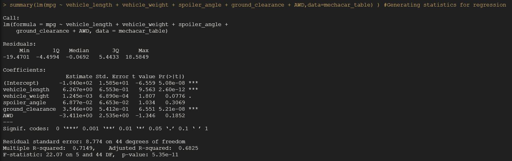
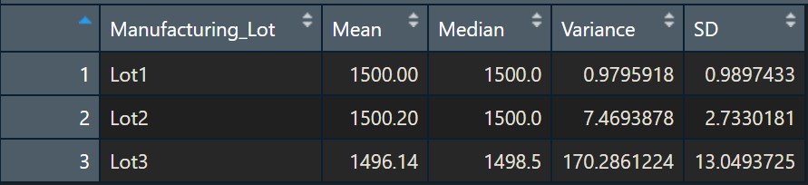
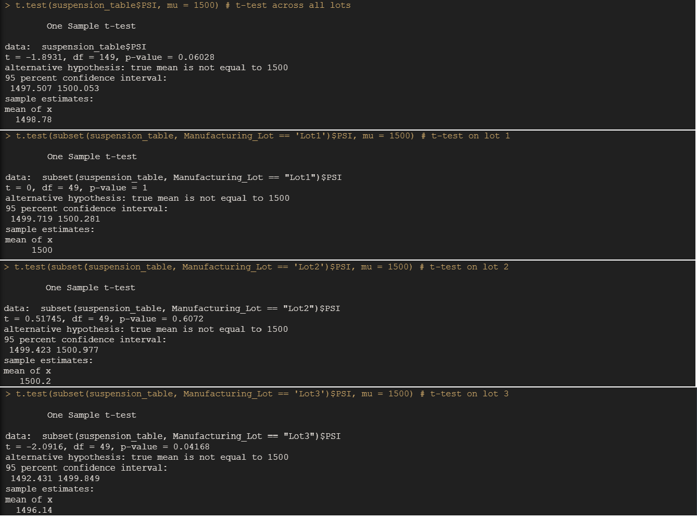

# MechaCar_Statistical_Analysis

## Linear Regression to Predict MPG

Fig 15.1.1 Output of Linear Regression for predicting MPG

After running regression model on the given dataset for Mechacar, following interpretations can be made on the asked questions:

1.	Which variables/coefficients provided a non-random amount of variance to the mpg values in the dataset?

As per the output shown in Fig 15.1.1, for 2 variables “Vehicle_Length” and “Ground_Clearance” , p-value is less than 0.05 and hence have high level of significance for the dependent variable. In other words, it means that the 2 variables are able to explain the variance in dependent variable which is MPG. Therefore, we can say that vehicle_length and ground_clearance are the 2 variables having non-random amount of variance to the MPG values.

2.	Is the slope of the linear model considered to be zero? Why or why not?

No, we cannot consider slope of the linear model to be zero. Slope of the linear model would be zero when none of the independent variable was able to explain the variance in the dependent variable. However, in our case we have already seen that 2 variables are showing some level of significance with the dependent variable and hence we cannot consider slope of linear model to be zero 

3.	Does this linear model predict mpg of MechaCar prototypes effectively? Why or why not?

Model fit or the R-Squared value for the model is 0.7149, which means our model is able to explain 71 percent of the variance in dependent variable (MPG) through our independent variable. It means there are other factor which contributes towards 30 percent of the variance in the dependent variable. If we keep threshold of 60% than yes our model predicts MPG effectively, however if we want that the prediction threshold to 85 or 90 percent, to understand variance in MPG than we have to add other factors / variables to the model to make it more effective.

## Summary Statistics on Suspension

By analysing suspension coils data and creating summary, following interpretation can be made to answer the asked question:

Question: 

The design specifications for the MechaCar suspension coils dictate that the variance of the suspension coils must not exceed 100 pounds per square inch. Does the current manufacturing data meet this design specification for all manufacturing lots in total and each lot individually? Why or why not?

Answers: 

Fig 15.2.1 Total Summary Table

As per the above summary details for all lots together, the variance for the manufacturing data is 62 PSI and hence well within the limit of 100 PSI as indicated in the design specifications. Hence, manufacturing data for all lots together meets the design specification criteria.

Fig 15.2.2 Lot wise Summary Table

However, if we analyse data by lots than there is one lot which is failing the design specification criteria. Lot1 and Lot2 are within the limits of the specified variance level of 100 PSI, whereas the third lot viz. lot3 is having variance of 170 PSI, which is well outside outside the limit of design criteria. Hence, we can say that lot3 fails design criteria of keeping variance within 100 PSI. 

## T-Tests on Suspension Coils

Fig 15.3 T-Test for determining statistical difference between manufacturing lots and population mean

If we consider significance level to be 95%, then upon analysing the t-test results as shown above p-value for all lots together, lot1 and lot2 is higher than 0.05. Hence, we fail to reject our null hypothesis that there is any significance difference between the mean of all manufacturing lots put together, lot1 & lot2 with population mean. However, for lot3 pvalue is lesser than 0.05 and for this lot we will be rejecting null hypothesis. Hence, we have statistical significance that there is difference between mean for lot3 and population mean. 

## Study Design: MechaCar vs Competition

To analyse how MechaCar performs against the competition, I would like to test competitor vehicles with MechaCar for city and highway fuel efficiencies. 

For the analysis hypothesis testing will be as following:
H0: Driving car for 100 miles will consume similar amount of fuel for MechaCar and its competitors
H1: Driving car for 100 mile will consume less fuel for MechaCar than its competitors

I will go for one-tail t-test as we are looking to understand that Mecha-Car is more fuel efficient than other cars and looking to detect the effect in one direction.

We require mileage data for different cars of different segments ran for 100 miles within a given settings like same road / circuit, same weather with similar carriage weight.

